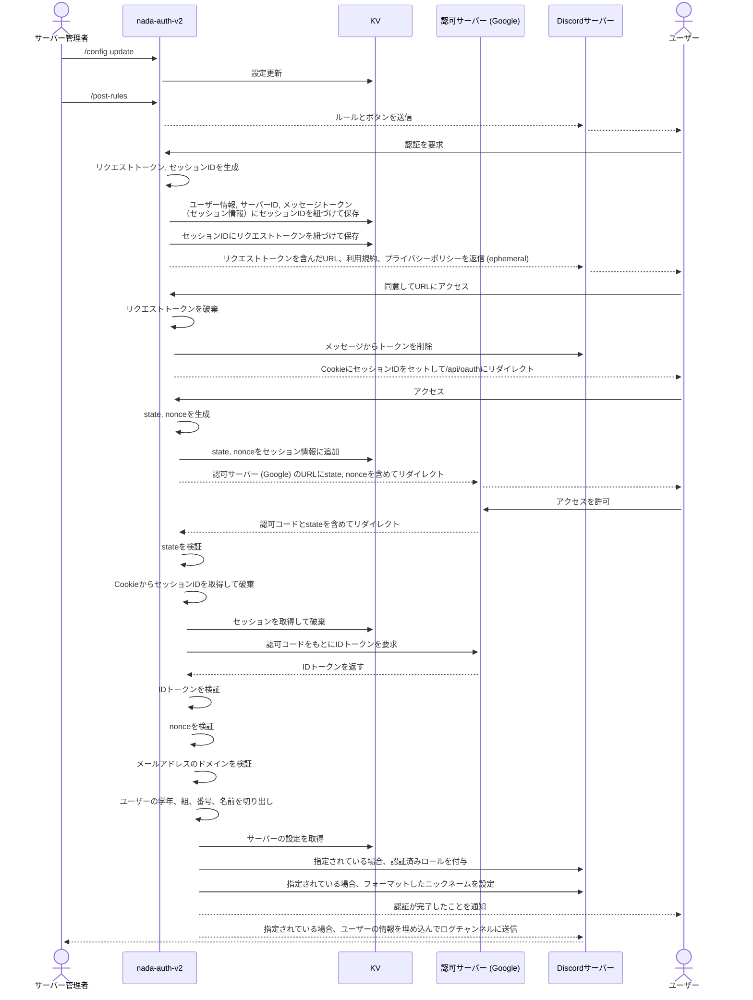

# nada-auth-v2

```sh
bun install
bun run dev
```


```mermaid
sequenceDiagram
    actor admin as サーバー管理者
    participant app as nada-auth-v2
    participant KV
    participant google as 認可サーバー (Google)
    participant discord as Discordサーバー
    actor user as ユーザー

    admin->>+app: /config update
    app->>+KV: 設定更新
    admin->>+app: /post-rules
    app-->>+discord: ルールとボタンを送信
    discord-->>+user: ;
    user->>+app: 認証を要求
    app->>+app: リクエストトークン, セッションIDを生成
    app->>+KV: ユーザー情報, サーバーID, メッセージトークン<br>（セッション情報）にセッションIDを紐づけて保存
    app->>+KV: セッションIDにリクエストトークンを紐づけて保存
    app-->>+discord: リクエストトークンを含んだURL、利用規約、プライバシーポリシーを返信 (ephemeral)
    discord-->>+user: ;
    user->>+app: 同意してURLにアクセス
    app->>+app: リクエストトークンを破棄
    app->>+discord: メッセージからトークンを削除
    app-->>+user: CookieにセッションIDをセットして/api/oauthにリダイレクト
    user->>+app: アクセス;
    app->>+app: state, nonceを生成
    app->>+KV: state, nonceをセッション情報に追加
    app-->>+google: 認可サーバー (Google) のURLにstate, nonceを含めてリダイレクト
    google-->>+user: ;
    user->>+google: アクセスを許可
    google-->>+app: 認可コードとstateを含めてリダイレクト
    app->>+app: stateを検証
    app->>+app: CookieからセッションIDを取得して破棄
    app->>+KV: セッションを取得して破棄
    app->>+google: 認可コードをもとにIDトークンを要求
    google-->>+app: IDトークンを返す
    app->>+app: IDトークンを検証
    app->>+app: nonceを検証
    app->>+app: メールアドレスのドメインを検証
    app->>+app: ユーザーの学年、組、番号、名前を切り出し
    app->>+KV: サーバーの設定を取得
    app->>+discord: 指定されている場合、認証済みロールを付与
    app->>+discord: 指定されている場合、フォーマットしたニックネームを設定
    app-->>+user: 認証が完了したことを通知
    app-->>+discord: 指定されている場合、ユーザーの情報を埋め込んでログチャンネルに送信
    discord-->>+admin: ;
```
